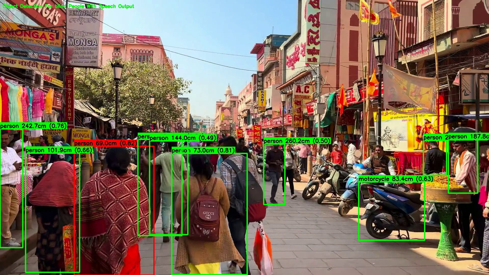
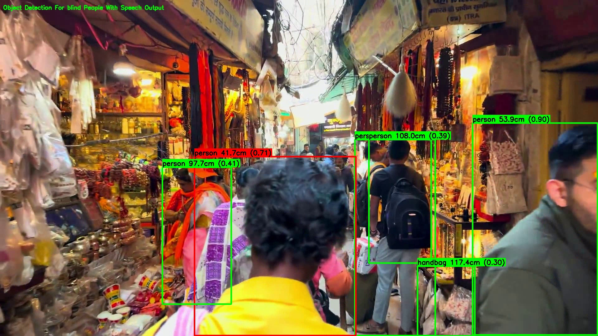

# 🎯 Smart Object Detection for Visually Impaired People with Pothole Detection

[](https://python.org)
[](https://opencv.org)
[](https://github.com/ultralytics/ultralytics)
[](https://pytorch.org)
[](https://developer.nvidia.com/cuda-toolkit)
[](LICENSE)

<div align="center">

**An advanced AI-powered computer vision system designed to assist visually impaired individuals through intelligent object detection, distance estimation, and audio feedback.**

[📹 View Demo](#-demo-videos) • [🚀 Quick Start](#-quick-start) • [📚 Documentation](#-documentation) • [⭐ Star](https://github.com/satviksangamkar11/Object-Detection-For-Blind-People-Using-Yolov8-With-Distance-Estimation-of-Multiple-Objects/stargazers)

</div>

---

## 🌟 Overview

This project implements a sophisticated dual-model YOLOv8-based computer vision system specifically designed to enhance mobility and safety for visually impaired individuals. The system combines:

- **🎯 Dual YOLOv8 Models**: General object detection (80+ COCO classes) + specialized pothole detection
- **📏 Intelligent Distance Estimation**: Real-time distance calculation using computer vision principles
- **🔊 Audio Feedback System**: Text-to-speech integration for hands-free navigation assistance
- **⚠️ Safety-First Design**: Prioritized pothole detection with color-coded visual warnings
- **⚡ Optimized Performance**: GPU-accelerated processing for real-time applications

## ✨ Key Features

| Feature | Description |
|---------|-------------|
| 🔍 **Dual-Model Detection** | Advanced YOLOv8-based detection for 80+ COCO classes + specialized pothole detection |
| 📏 **Distance Estimation** | Accurate real-time distance calculation using computer vision principles |
| 🔊 **Audio Feedback** | Text-to-speech integration for hands-free navigation assistance |
| ⚠️ **Pothole Safety Alerts** | Specialized detection and warning system for road hazards |
| 📹 **Multiple Input Sources** | Support for live camera feed and video files |
| ⚡ **Optimized Performance** | GPU-accelerated processing with configurable detection intervals |
| 🎨 **Visual Annotations** | Customizable bounding boxes with color-coded priority system |
| 📸 **Visual Demonstrations** | Static examples showing detection capabilities in various environments |
| 🎯 **Smart Filtering** | Confidence-based detection filtering and largest object prioritization |
| 🔄 **Real-time Processing** | Threaded video capture and async speech synthesis for smooth performance |

## 🎬 Demo Videos & Visual Examples

<div align="center">

### 🚗 Object Detection Demo
<video width="640" height="480" controls>
  <source src="output_recordings/detection_output.mp4" type="video/mp4">
  Your browser does not support the video tag.
</video>

*Real-time object detection with distance estimation and audio feedback*

### 🎯 Visual Output with Annotations
<video width="640" height="480" controls>
  <source src="output_recordings/visual output.mp4" type="video/mp4">
  Your browser does not support the video tag.
</video>

*Enhanced visual output with color-coded detections and safety prioritization*

### 📸 System Detection Examples

#### 🏙️ Busy Street Scene Detection


*Advanced object detection in crowded urban environments with real-time distance estimation for people, vehicles, and obstacles*

#### 🏪 Market Area Detection


*Intelligent detection system identifying people, bags, and objects in bustling market environments with precise distance measurements*


</div>

## 🚀 Quick Start

### Prerequisites

- Python 3.8 or higher
- Webcam or video file
- Windows/macOS/Linux
- NVIDIA GPU with CUDA 11.8+ (recommended for optimal performance)
- 4GB+ RAM (8GB+ recommended)

### Installation

1. **Clone the repository**
   ```bash
   git clone https://github.com/satviksangamkar11/Object-Detection-For-Blind-People-Using-Yolov8-With-Distance-Estimation-of-Multiple-Objects.git
   cd Object-Detection-For-Blind-People-Using-Yolov8-With-Distance-Estimation-of-Multiple-Objects
   ```

2. **Install Python dependencies**
   ```bash
   pip install torch torchvision torchaudio --index-url https://download.pytorch.org/whl/cu118
   pip install opencv-python pyttsx3 ultralytics numpy
   ```

3. **Verify GPU setup (recommended)**
   ```bash
   python -c "import torch; print(f'CUDA available: {torch.cuda.is_available()}')"
   ```

4. **Create required directories and files**
   ```bash
   mkdir -p utils weights output_recordings
   ```

5. **Download COCO class names**
   ```bash
   # COCO class names file should be in utils/coco.txt
   # The file is included in the repository
   ```

## 📁 Project Structure

```
Object-Detection-For-Blind-People-Using-Yolov8-With-Distance-Estimation-of-Multiple-Objects/
├── 📄 README.md                           # Project documentation
├── 🚀 smart_object_detector.py           # Main dual-model application (recommended)
├── 🏋️ train_pothole_detector.py          # Pothole detection model training script
├── 📁 images/                            # Static demonstration images
│   ├── 🖼️ img1.jpg                      # Market area detection example
│   └── 🖼️ img2.jpg                      # Street scene detection example
├── 📁 output_recordings/                 # Demo output videos
│   ├── 🎬 detection_output.mp4           # Object detection demonstration
│   └── 🎯 visual output.mp4              # Visual output with annotations
├── 📁 utils/
│   └── 📋 coco.txt                       # COCO class names (80 classes)
├── 📁 weights/                           # Model weights
│   ├── 🤖 yolov8n.pt                     # Base YOLOv8 nano model
│   └── 🦺 yolov8n_pothole.pt             # Trained pothole detection model
└── 📁 pothole_dataset/
    └── ⚙️ data.yaml                      # Dataset configuration for training
```

## 🚀 Quick Start

### 🛠️ Installation & Setup

1. **Clone the repository**
   ```bash
   git clone https://github.com/satviksangamkar11/Object-Detection-For-Blind-People-Using-Yolov8-With-Distance-Estimation-of-Multiple-Objects.git
   cd Object-Detection-For-Blind-People-Using-Yolov8-With-Distance-Estimation-of-Multiple-Objects
   ```

2. **Install dependencies**
   ```bash
   pip install torch torchvision torchaudio --index-url https://download.pytorch.org/whl/cu118
   pip install opencv-python pyttsx3 ultralytics numpy
   ```

3. **Verify GPU setup (recommended)**
   ```bash
   python -c "import torch; print(f'CUDA available: {torch.cuda.is_available()}')"
   ```

### 🎯 Usage

#### 🚀 Run Object Detection (Recommended)
```bash
python smart_object_detector.py
```

#### 🏋️ Train Pothole Detection Model
```bash
python train_pothole_detector.py
```
## 📊 Training Configuration

### Pothole Detection Model Training

The system includes a specialized pothole detection model trained on a custom dataset:

**Training Configuration:**
- **Model**: YOLOv8n (nano) - optimized for speed and efficiency
- **Dataset**: Custom pothole dataset with 1 class ('pothole')
- **Epochs**: 50 epochs with early stopping (patience=10)
- **Image Size**: 640x640 pixels
- **Batch Size**: 16 (auto-adjusts based on GPU memory)
- **Hardware**: GPU acceleration with CUDA support

**Training Results:**
- **Best Model**: `weights/yolov8n_pothole.pt`
- **Validation Metrics**: See `runs/pothole_detect/yolov8n_pothole/` for detailed results
- **Performance**: Optimized for real-time detection on edge devices

## 🎬 Live Demonstrations

<div align="center">

### 🚗 Object Detection Demo
<video width="640" height="480" controls>
  <source src="output_recordings/detection_output.mp4" type="video/mp4">
  Your browser does not support the video tag.
</video>

*Real-time object detection with distance estimation and audio feedback*

### 🎯 Visual Output with Annotations
<video width="640" height="480" controls>
  <source src="output_recordings/visual output.mp4" type="video/mp4">
  Your browser does not support the video tag.
</video>

*Enhanced visual output with color-coded detections and safety prioritization*

</div>

## ⚙️ Configuration

### Key Parameters

| Parameter | Description | Default Value | Optimized For |
|-----------|-------------|---------------|---------------|
| `FOCAL_LENGTH` | Camera focal length for distance calculation | 360 | General use |
| `KNOWN_WIDTH` | Reference object width in cm | 60 | Average object size |
| `DETECTION_INTERVAL` | Detection interval in seconds | 0.033 | 30 FPS detection |
| `CONFIDENCE_THRESHOLD` | Minimum confidence for detection | 0.5 | Balanced accuracy/speed |

### Performance Tuning

#### For Enhanced Speed
```python
# Reduce input resolution for faster processing
INPUT_WIDTH = 224  # 4x faster processing
CONFIDENCE_THRESHOLD = 0.3  # More detections, lower precision
```

#### For Maximum Accuracy
```python
# Increase input resolution for better accuracy
INPUT_WIDTH = 640  # Maximum accuracy
CONFIDENCE_THRESHOLD = 0.7  # Fewer but more confident detections
```

## 🔧 Technical Architecture

### 🤖 Dual-Model Architecture

The system employs two specialized YOLOv8 models for comprehensive detection:

| Model | Purpose | Classes | Training Data |
|-------|---------|---------|---------------|
| **YOLOv8n** | General object detection | 80 COCO classes | Pre-trained on COCO dataset |
| **YOLOv8n-Pothole** | Safety hazard detection | 1 class (pothole) | Custom pothole dataset |

### 📐 Distance Estimation Algorithm

The system uses the pinhole camera model for distance estimation:

```
Distance (cm) = (Known Width × Focal Length) / Width in Pixels
```

**Parameters:**
- **Known Width**: Reference object width (60cm default)
- **Focal Length**: Camera focal length (360 default)
- **Width in Pixels**: Detected object width in image pixels

### ⚡ Performance Optimizations

- **GPU Acceleration**: CUDA support for 10-50x speed improvement
- **Optimized Input Resolution**: 320×320 for 4x processing speed
- **Asynchronous Processing**: Threaded video capture and speech synthesis
- **Smart Frame Processing**: Configurable detection intervals for smooth performance

## 🎯 Supported Object Classes

The system can detect **81 different object classes**:

### Standard COCO Classes (80 classes)
- **People**: person
- **Vehicles**: car, truck, bus, motorcycle, bicycle, airplane, train
- **Animals**: cat, dog, horse, cow, bird, sheep, elephant, bear
- **Furniture**: chair, table, bed, couch, sofa, dining table
- **Electronics**: laptop, mouse, keyboard, cell phone, tv, remote
- **Food**: banana, apple, orange, pizza, cake, sandwich, hot dog
- **Sports**: tennis racket, baseball bat, skateboard, surfboard
- **Indoor**: bottle, wine glass, cup, fork, knife, spoon, bowl
- **And many more**: Including traffic lights, stop signs, parking meters, etc.

### Specialized Safety Classes (1 class)
- **Road Hazards**: **pothole** (custom-trained model for enhanced safety)

**Total Detection Capability**: 81 classes with dual-model architecture for comprehensive environmental awareness.

## 🛠️ Troubleshooting

### Common Issues

1. **CUDA/GPU not detected**
   ```bash
   # Check GPU availability
   python -c "import torch; print(torch.cuda.is_available())"

   # Install correct PyTorch version for your CUDA version
   pip uninstall torch torchvision
   pip install torch torchvision --index-url https://download.pytorch.org/whl/cu118
   ```

2. **Model loading errors**
   ```bash
   # Check if model files exist
   ls -la weights/

   # Download missing models
   # YOLOv8n will auto-download on first run
   ```

3. **Camera/Permission issues**
   ```bash
   # Check camera permissions and availability
   cap = cv2.VideoCapture(0)  # Try different indices: 1, 2, etc.

   # For Linux/Mac, check video device permissions
   sudo usermod -a -G video $USER
   ```

4. **Audio/TTS not working**
   ```bash
   # Install additional TTS dependencies
   pip install pywin32  # For Windows
   pip install espeak   # For Linux/macOS

   # Check audio drivers and system sound settings
   ```

5. **Performance issues**
   - **Reduce input resolution**: Set `INPUT_WIDTH = 224` for faster processing
   - **Lower confidence threshold**: Set `CONFIDENCE_THRESHOLD = 0.3` for more detections
   - **Increase frame skipping**: Increase `SKIP_FRAMES` value
   - **Use CPU only**: Force `DEVICE = 'cpu'` for compatibility

6. **Memory issues during training**
   ```bash
   # Reduce batch size in training
   # Edit train_pothole_detector.py and set batch=8 or batch=4
   ```

## 📊 Performance Metrics

### Base Model Performance (YOLOv8n)

| Model | Speed (FPS) | mAP@0.5 | Size (MB) | Use Case |
|-------|-------------|---------|-----------|----------|
| YOLOv8n | ~45 | 37.3 | 6.2 | **Recommended** - Best speed/accuracy balance |
| YOLOv8s | ~35 | 44.9 | 21.5 | Higher accuracy, slower speed |
| YOLOv8m | ~25 | 50.2 | 49.7 | Maximum accuracy, resource intensive |

### System Performance (Optimized Configuration)

- **Input Resolution**: 320×320 (4× faster than 640×640)
- **Detection Rate**: 30 FPS with GPU acceleration
- **Memory Usage**: ~2GB VRAM (GPU) / ~4GB RAM (CPU)
- **Audio Latency**: <100ms response time
- **Dual-Model Inference**: ~15ms per frame (RTX 30-series)

### Pothole Detection Model Performance

- **Training Dataset**: Custom pothole dataset (1 class)
- **Model Size**: 6.2 MB (same as base YOLOv8n)
- **Inference Speed**: Same as base model (~45 FPS)
- **Accuracy**: Optimized for real-time pothole detection
- **Validation Results**: See `runs/pothole_detect/yolov8n_pothole/results.csv`

## 🤝 Contributing

We welcome contributions! Please follow these steps:

1. Fork the repository
2. Create a feature branch (`git checkout -b feature/AmazingFeature`)
3. Commit your changes (`git commit -m 'Add some AmazingFeature'`)
4. Push to the branch (`git push origin feature/AmazingFeature`)
5. Open a Pull Request

## 📝 License

This project is licensed under the MIT License - see the [LICENSE](LICENSE) file for details.

## 🙏 Acknowledgments

- [Ultralytics](https://github.com/ultralytics/ultralytics) for YOLOv8 implementation
- [OpenCV](https://opencv.org/) for computer vision capabilities
- [COCO Dataset](https://cocodataset.org/) for object detection classes
- [pyttsx3](https://github.com/nateshmbhat/pyttsx3) for text-to-speech functionality

## 📞 Contact

**Satvik Sangamkar**
- GitHub: [@satviksangamkar11](https://github.com/satviksangamkar11)
- Project Link: [Object Detection for Blind People](https://github.com/satviksangamkar11/Object-Detection-For-Blind-People-Using-Yolov8-With-Distance-Estimation-of-Multiple-Objects)

## 🌟 Star History

[](https://star-history.com/#satviksangamkar11/Object-Detection-For-Blind-People-Using-Yolov8-With-Distance-Estimation-of-Multiple-Objects&Date)

---

**⭐ If you found this project helpful, please give it a star!**
